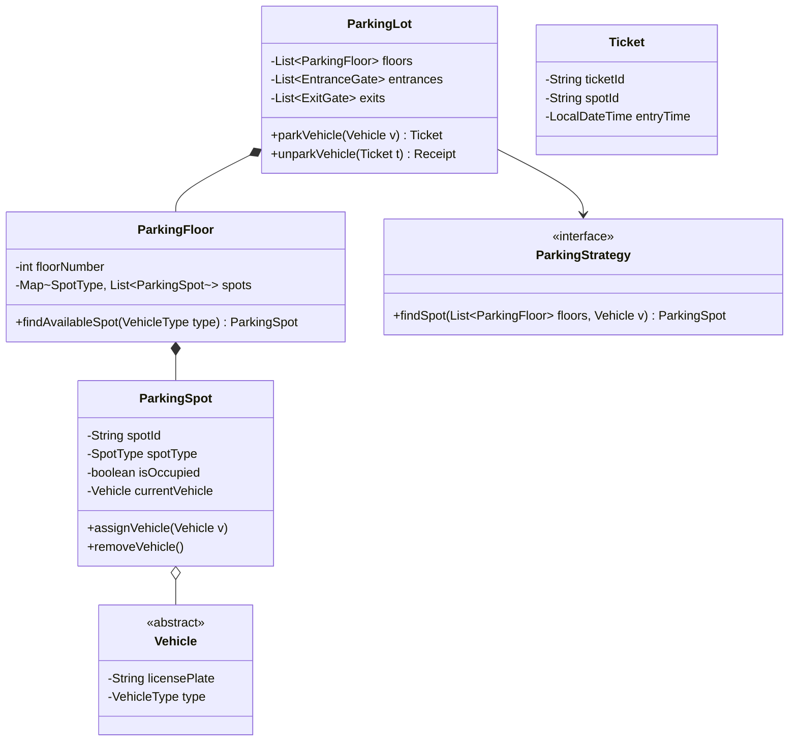

# 🏛️ Low-Level Design (LLD) & Object-Oriented Programming Mastery Guide

A comprehensive, interview-proven blueprint for mastering Object-Oriented Programming (OOP) and Low-Level Design (LLD) interviews at top-tier product and FAANG companies (Google, Amazon, Microsoft, Uber, Meta, Apple).

---

## 📑 Table of Contents

1. [🎯 Why LLD Matters in Technical Interviews](#1-why-lld-matters-in-technical-interviews)
2. [🧱 The 4 Pillars of OOP (Architectural Impact)](#2-the-4-pillars-of-oop)
3. [📐 SOLID Principles in Action (Code Snippets & Traps)](#3-solid-principles-in-action)
4. [🎨 Core Gang-of-Four (GoF) Design Patterns for LLD](#4-core-gang-of-four-gof-design-patterns-for-lld)
5. [🧵 Concurrency & Thread-Safety in LLD Systems](#5-concurrency--thread-safety-in-lld-systems)
6. [⏱️ The 5-Step 45-Minute LLD Interview Execution Playbook](#6-the-5-step-45-minute-lld-interview-execution-playbook)
7. [🗺️ The 7 Curated OOP Problems Blueprint](#7-the-7-curated-oop-problems-blueprint)
    * [Problem 1: Design Parking Lot](#problem-1-design-parking-lot)
    * [Problem 2: Design Elevator System](#problem-2-design-elevator-system)
    * [Problem 3: Design Chess Game](#problem-3-design-chess-game)
    * [Problem 4: Design Connect Four](#problem-4-design-connect-four)
    * [Problem 5: Design Blackjack (Card Game)](#problem-5-design-blackjack-card-game)
    * [Problem 6: Design Banking System](#problem-6-design-banking-system)
    * [Problem 7: Design Movie Recommendation System](#problem-7-design-movie-recommendation-system)
8. [📊 Object Relationships Cheatsheet (UML Quick Ref)](#8-object-relationships-cheatsheet)
9. [⚠️ Top 10 High-Frequency OOP & LLD Anti-Patterns](#9-top-10-high-frequency-oop--lld-anti-patterns)
10. [✅ Pre-Practice Self-Assessment Rubric](#10-pre-practice-self-assessment-rubric)

---

## 1. 🎯 Why LLD Matters in Technical Interviews

While Data Structures & Algorithms test your problem-solving speed and algorithmic efficiency ($O(N)$ vs $O(N^2)$), **Low-Level Design (LLD / Machine Coding / OOD)** tests whether you write code like a junior hacker or a senior software engineer.

Interviewers evaluate:
- **Modularity & Separation of Concerns**: Is business logic entangled with state management or I/O?
- **Extensibility (Open/Closed Principle)**: Can a new vehicle type, pricing policy, or game piece be added without editing existing, tested classes?
- **Clarity & Readability**: Are class and method names self-explanatory?
- **Correctness & Edge Handling**: Do you handle invalid moves, full parking spots, or simultaneous balance withdrawals?
- **Thread Safety**: What happens when two threads try to book the same spot simultaneously?

---

## 2. 🧱 The 4 Pillars of OOP (Architectural Impact)

| Pillar | Academic Definition | Architectural Reality in Interviews |
| :--- | :--- | :--- |
| **Encapsulation** | Bundling data with methods operating on that data. | **Data Hiding & Invariant Protection**: Make fields `private final`. Expose read-only views (e.g., `Collections.unmodifiableList()`) to prevent callers from corrupting internal state. |
| **Abstraction** | Hiding complex reality behind simple interfaces. | **Contract over Implementation**: Callers interact with `PaymentProcessor` or `PricingStrategy` without knowing whether it uses Stripe, Cash, or Hourly Dynamic Surge. |
| **Inheritance** | Deriving new classes from existing classes. | **Is-A Hierarchy (Use Sparingly!)**: Overusing inheritance creates rigid hierarchies. Always prefer **Composition over Inheritance** unless a strict behavioral subtype relationship exists. |
| **Polymorphism** | Ability of different objects to respond to the same message in distinct ways. | **Dynamic Strategy Swapping**: A method accepts `Vehicle` and invokes `vehicle.getRequiredSpotSize()` without sprawling `switch(vehicleType)` statements. |

### Architectural Best Practice: Composition Over Inheritance

```java
// ❌ BAD: Fragile inheritance (Inheriting state and behavior you might not want)
public class ElectricCar extends Car {
    // Inherits gas tank attributes that make no sense!
}

// ✅ GOOD: Composition (Injecting capabilities)
public class Vehicle {
    private final String licensePlate;
    private final VehicleSize size;
    private final PropulsionSystem propulsion; // Can be Electric, InternalCombustion, Hybrid

    public Vehicle(String licensePlate, VehicleSize size, PropulsionSystem propulsion) {
        this.licensePlate = licensePlate;
        this.size = size;
        this.propulsion = propulsion;
    }
}
```

---

## 3. 📐 SOLID Principles in Action

### 1. Single Responsibility Principle (SRP)
> *"A class should have one, and only one, reason to change."*

- **Violation**: Having `ParkingLot` handle spot allocation, generate tickets, calculate taxes, process credit card payments, and print ASCII receipts.
- **Solution**:
    - `ParkingLot`: Manages floors, gates, and spot availability.
    - `FeeCalculator`: Computes cost based on duration and vehicle type.
    - `PaymentService`: Interacts with payment gateway.
    - `TicketRepository`: Stores active and completed tickets.

### 2. Open/Closed Principle (OCP)
> *"Software entities should be open for extension, but closed for modification."*

- **Violation**:
  ```java
  public double calculateFee(Vehicle vehicle, long durationHours) {
      if (vehicle.getType() == VehicleType.CAR) return durationHours * 20.0;
      else if (vehicle.getType() == VehicleType.BIKE) return durationHours * 10.0;
      else if (vehicle.getType() == VehicleType.TRUCK) return durationHours * 50.0;
      // Adding EV requires modifying this core method!
  }
  ```
- **Solution**: Use the **Strategy Pattern**:
  ```java
  public interface PricingStrategy {
      double calculateFee(long durationHours);
  }

  public class CarPricingStrategy implements PricingStrategy { ... }
  public class EVChargingPricingStrategy implements PricingStrategy { ... }
  ```

### 3. Liskov Substitution Principle (LSP)
> *"Subtypes must be substitutable for their base types without altering program correctness."*

- **Classic Violation**: `Square extends Rectangle`. Setting `width` on a `Square` unexpectedly changes `height`, breaking expectations of methods operating on `Rectangle`.
- **In LLD**: If `Pawn extends ChessPiece`, but calling `pawn.canMove(x, y)` throws `UnsupportedOperationException` for backward moves while the base interface assumes all pieces can query generic moves, LSP is violated.

### 4. Interface Segregation Principle (ISP)
> *"Clients should not be forced to depend on methods they do not use."*

- **Violation**: A giant `GameController` interface with `rollDice()`, `dealCard()`, `makeMove()`, `checkmate()`, `doubleDown()`.
- **Solution**: Small, role-specific interfaces:
  ```java
  public interface BoardGame { void makeMove(Move move); boolean isGameOver(); }
  public interface CardGame { void dealCards(); Hand evaluateHand(); }
  ```

### 5. Dependency Inversion Principle (DIP)
> *"High-level modules should not depend on low-level modules. Both should depend on abstractions."*

- **Violation**: `ElevatorController` directly instantiates `new NearestCarDispatchAlgorithm()`.
- **Solution**: `ElevatorController` accepts `ElevatorDispatchStrategy` interface via constructor dependency injection.

---

## 4. 🎨 Core Gang-of-Four (GoF) Design Patterns for LLD

| Pattern Type | Pattern Name | Problem Signal / Trigger in Interviews | Example in Curated Problems |
| :--- | :--- | :--- | :--- |
| **Creational** | **Factory Method** | Creation logic depends on input (e.g. type string or enum) and should be decoupled from client. | Creating `Vehicle` (Car, Bike, Truck) or `ChessPiece` (Pawn, Rook). |
| **Creational** | **Builder** | Object has many optional parameters, telescopic constructors become unreadable. | Building a `Ticket`, `MovieQuery`, or `BankCustomerAccount`. |
| **Creational** | **Singleton** | Exactly one coordinated global instance needed (thread-safe). | `ElevatorSystem` or `ParkingLotManager`. |
| **Behavioral** | **Strategy** | Multiple algorithms interchangeable at runtime (pricing, sorting, dispatching). | `PricingStrategy` in Parking Lot, `RecommendationStrategy` in Movie system. |
| **Behavioral** | **State** | Object changes behavior when internal state changes without nested `if/else`. | `ElevatorCar` states (`IDLE`, `MOVING_UP`, `MOVING_DOWN`, `MAINTENANCE`). |
| **Behavioral** | **Observer** | When one object changes state, all dependents are notified automatically. | Display boards updating when spots fill; Elevator floor arrivals notifying passengers. |
| **Behavioral** | **Command** | Encapsulate request as an object (supports Undo/Redo, queues, logs). | Moves in `Chess` or `ConnectFour`; Transactions in `Bank`. |
| **Structural** | **Decorator** | Dynamically add features/costs to objects without subclassing. | Parking fees: base parking + EV charging + car wash + overnight surcharge. |
| **Structural** | **Adapter** | Make incompatible interfaces work together. | Connecting third-party payment gateways (Stripe/PayPal) to internal `PaymentProcessor`. |

### Interview-Safe Singleton (Thread-safe Double-Checked Locking)

```java
public class ParkingLotManager {
    // volatile ensures changes are immediately visible across threads and prevents instruction reordering
    private static volatile ParkingLotManager instance;

    private ParkingLotManager() {
        // Prevent reflection instantiation
        if (instance != null) {
            throw new IllegalStateException("Already initialized");
        }
    }

    public static ParkingLotManager getInstance() {
        if (instance == null) {
            synchronized (ParkingLotManager.class) {
                if (instance == null) {
                    instance = new ParkingLotManager();
                }
            }
        }
        return instance;
    }
}
```

*Alternative (Item 3 in Effective Java)*: Use an **Enum Singleton** (`public enum ParkingLot { INSTANCE; ... }`) for 100% thread safety, serialization safety, and reflection immunity.

---

## 5. 🧵 Concurrency & Thread-Safety in LLD Systems

In modern tech interviews, you will frequently be asked:
> *"What happens if 10 cars arrive at the entry gate simultaneously and only 1 spot is available?"*
> *"What if two users transfer money between each other's accounts at the exact same millisecond?"*

### Key Concurrency Tools in Java:

1. **`AtomicInteger` / `AtomicBoolean`**: Non-blocking atomic counters (e.g., generating unique ticket IDs, available spot count).
2. **`ConcurrentHashMap<K, V>`**: Thread-safe key-value lookups without synchronizing entire map reads.
3. **`ReentrantLock` & `ReentrantReadWriteLock`**:
   - Multiple threads can read concurrently (`readLock()`).
   - Only one thread can modify (`writeLock()`).
4. **Preventing Deadlocks in Two-Way Resource Allocation (e.g., Bank Transfer)**:

```java
// ❌ BUG: Deadlock risk if Thread 1 transfers A -> B while Thread 2 transfers B -> A!
public void transfer(Account from, Account to, double amount) {
    synchronized(from) {
        synchronized(to) {
            from.withdraw(amount);
            to.deposit(amount);
        }
    }
}

// ✅ SOLUTION: Strict Lock Ordering by deterministic ID
public void transfer(Account from, Account to, double amount) {
    Account firstLock = from.getId().compareTo(to.getId()) < 0 ? from : to;
    Account secondLock = from.getId().compareTo(to.getId()) < 0 ? to : from;

    synchronized(firstLock) {
        synchronized(secondLock) {
            from.withdraw(amount);
            to.deposit(amount);
        }
    }
}
```

---

## 6. ⏱️ The 5-Step 45-Minute LLD Interview Execution Playbook

```text
[00:00 - 08:00]  STEP 1: Clarify Requirements, Constraints & Scope
[08:00 - 15:00]  STEP 2: Identify Core Entities, Enums & Value Objects
[15:00 - 22:00]  STEP 3: Establish Relationships & Class Hierarchy (Interfaces)
[22:00 - 37:00]  STEP 4: Implement Core Logic with Design Patterns (Clean Code)
[37:00 - 45:00]  STEP 5: Concurrency, Edge Cases & Standalone Driver Test Run
```

### Step 1: Clarify Requirements & Scope (0 - 8 mins)
- Ask 3–4 clarifying questions:
    - *"Is this a single-floor or multi-floor parking lot?"*
    - *"What vehicle types are supported?"*
    - *"Is pricing flat, hourly, or vehicle-dependent?"*
    - *"Do we need concurrency protection for multiple gates?"*
- Explicitly state **Out of Scope** items (e.g., UI, real hardware sensors, DB persistence).

### Step 2: Identify Core Entities (8 - 15 mins)
- Extract nouns from the problem description:
    - *Parking Lot*: `Vehicle`, `ParkingSpot`, `ParkingFloor`, `Ticket`, `Payment`, `Gate`.
    - *Elevator*: `ElevatorCar`, `Button`, `Request`, `Door`, `Floor`, `Dispatcher`.
- Define Enums first (e.g., `VehicleType`, `SpotType`, `Direction`, `Status`).

### Step 3: Define Contracts & Interfaces (15 - 22 mins)
- Design interfaces for extensible components:
    - `ParkingStrategy`: `findSpot(VehicleType type)`
    - `PricingStrategy`: `calculateCost(Ticket ticket)`
    - `DispatchAlgorithm`: `selectBestElevator(List<ElevatorCar> cars, Request req)`

### Step 4: Implement Business Logic (22 - 37 mins)
- Write clean, cohesive methods.
- Validate inputs (never allow negative amounts, null vehicles, or out-of-bound coordinates).
- Handle state transitions cleanly (e.g., `spot.park(vehicle)` marks spot occupied and binds vehicle).

### Step 5: Test Harness & Concurrency Wrap-up (37 - 45 mins)
- Write a clear `main()` simulation running happy paths, edge cases (e.g., lot full, insufficient balance), and outputting verification logs.

---

## 7. 🗺️ The 7 Curated OOP Problems Blueprint

Here is the architectural blueprint for each problem located in [`OOP/src/`](file:///Users/zml-mac-ranveerg-01/IdeaProjects/Data%20Strucure%20and%20Algorithms/OOP/src):

```
OOP/src/
├── DesignParkingLot.java          # Multi-floor parking lot with gates, tickets, pricing & strategy
├── DesignElevatorSystem.java       # Multi-car elevator dispatcher with SCAN algorithm & state machine
├── DesignChess.java                # 8x8 Board, piece movements, check/checkmate & move history
├── DesignConnectFour.java          # Gravity-based disc drop grid, winning alignment validator
├── DesignBlackJack.java            # Deck, Card shoe, Player/Dealer hands, Ace dual-scoring
├── DesignBank.java                 # Thread-safe accounts, atomic transfers, deadlock prevention & audit log
└── DesginMovieRecomendation.java   # User profiles, ratings, genre similarity & collaborative filtering
```

---

### Problem 1: Design Parking Lot
*File*: [`OOP/src/DesignParkingLot.java`](file:///Users/zml-mac-ranveerg-01/IdeaProjects/Data%20Strucure%20and%20Algorithms/OOP/src/DesignParkingLot.java)  
*Difficulty*: Medium | *Companies*: Amazon, Google, Uber, Microsoft

#### Key Requirements:
- Multi-floor parking lot with multiple entry and exit gates.
- Support various vehicle types: Motorcycle, Car, Van, Truck, Electric Vehicle.
- Specific spot types: Compact, Large, Motorcycle, Handicapped, EV with charging.
- Spot allocation strategies: Nearest to entrance, Lowest floor first, Best fit.
- Automated ticketing: Issue ticket upon entry; calculate fees based on duration and vehicle rate upon exit.
- Real-time availability display board per floor.

#### Architecture & Design Patterns:


- **Patterns**:
    - **Strategy**: Spot allocation (`NearestSpotStrategy`, `BestFitStrategy`) and Fee calculation (`HourlyFeeStrategy`, `FlatFeeStrategy`).
    - **Factory**: `VehicleFactory` to instantiate vehicle models.
    - **Observer**: `DisplayBoard` updates when spots become free or occupied.
    - **Singleton**: `ParkingLot` instance managing global state.

---

### Problem 2: Design Elevator System
*File*: [`OOP/src/DesignElevatorSystem.java`](file:///Users/zml-mac-ranveerg-01/IdeaProjects/Data%20Strucure%20and%20Algorithms/OOP/src/DesignElevatorSystem.java)  
*Difficulty*: Medium–Hard | *Companies*: Google, Microsoft, Amazon

#### Key Requirements:
- System controls $N$ elevator cars across $M$ floors.
- Two types of requests:
    - **External Hall Call**: Passenger on Floor $F$ presses Up or Down.
    - **Internal Destination Call**: Passenger inside Car $C$ presses Floor $D$.
- Scheduling / Dispatch algorithm: Minimize waiting time and energy consumption (LOOK / SCAN algorithm).
- Elevator states: `IDLE`, `MOVING_UP`, `MOVING_DOWN`, `MAINTENANCE`.
- Door operation: Open, close, safety sensor obstruction, emergency stop.

#### Architecture & Design Patterns:
- **Patterns**:
    - **State Pattern**: `ElevatorState` managing behavior (`MovingUpState`, `MovingDownState`, `IdleState`).
    - **Strategy Pattern**: `DispatchStrategy` (`NearestCarFirst`, `ScanAlgorithm`, `OddEvenFloorsStrategy`).
    - **Observer Pattern**: Floor button lights notify controller; Elevator notifies internal display.
- **Key Algorithm (LOOK / Elevator SCAN)**:
    - Keep two priority queues per car: `upQueue` (min-heap) and `downQueue` (max-heap).
    - If moving UP, serve all requests $\ge \text{currentFloor}$ in ascending order.
    - When `upQueue` is exhausted, switch direction to DOWN and serve `downQueue` in descending order.

---

### Problem 3: Design Chess Game
*File*: [`OOP/src/DesignChess.java`](file:///Users/zml-mac-ranveerg-01/IdeaProjects/Data%20Strucure%20and%20Algorithms/OOP/src/DesignChess.java)  
*Difficulty*: Hard | *Companies*: Google, Amazon, Uber

#### Key Requirements:
- 8x8 Board with alternating colored cells (`Spot`).
- Two players: White and Black taking alternating turns.
- Pieces: King, Queen, Rook, Bishop, Knight, Pawn with specific valid move validation.
- Special moves (bonus/follow-up): Castling, En Passant, Pawn Promotion.
- Game states: `ACTIVE`, `CHECK`, `CHECKMATE`, `STALEMATE`, `FORFEIT`.
- Move history tracking and Undo/Redo capability.

#### Architecture & Design Patterns:
- **Patterns**:
    - **Command Pattern**: Encapsulate each `Move` as a command with `execute()` and `undo()` for move history.
    - **Factory Pattern**: `PieceFactory` to initialize the starting 32 pieces on the board.
    - **Template Method / Polymorphism**: Base abstract class `Piece` with abstract `boolean canMove(Board board, Spot start, Spot end)`.
    - **Singleton**: Board instance per game session.

---

### Problem 4: Design Connect Four
*File*: [`OOP/src/DesignConnectFour.java`](file:///Users/zml-mac-ranveerg-01/IdeaProjects/Data%20Strucure%20and%20Algorithms/OOP/src/DesignConnectFour.java)  
*Difficulty*: Medium | *Companies*: Google, Microsoft, Meta

#### Key Requirements:
- Standard 7 columns $\times$ 6 rows grid (support $N \times M$ grid extension).
- Two players (Red and Yellow discs).
- Gravity mechanic: Players choose a column; the disc falls to the lowest unoccupied slot in that column.
- Move validation: Disallow moves in full columns; disallow out-of-turn play.
- Win detection: Check if dropping the disc creates 4 connected discs in any of the 4 directions:
    - Horizontal ($\leftrightarrow$)
    - Vertical ($\updownarrow$)
    - Positive Diagonal ($\nearrow$)
    - Negative Diagonal ($\searrow$)
- Detect Draw when all $N \times M$ cells are filled without a winner.

#### Architecture & Design Patterns:
- **Patterns**:
    - **Strategy Pattern**: `WinConditionStrategy` (e.g., standard 4-in-a-row vs connect-K).
    - **Command Pattern**: Storing move logs for replay or undo functionality.
- **Optimization**: Check win condition only around the newly placed disc in the 4 directions within a range of 3 cells, achieving $O(1)$ win evaluation per turn instead of $O(R \times C)$ full-board scanning.

---

### Problem 5: Design Blackjack (Card Game)
*File*: [`OOP/src/DesignBlackJack.java`](file:///Users/zml-mac-ranveerg-01/IdeaProjects/Data%20Strucure%20and%20Algorithms/OOP/src/DesignBlackJack.java)  
*Difficulty*: Medium | *Companies*: Bloomberg, Amazon, Meta

#### Key Requirements:
- Standard 52-card deck (Suit: Hearts, Diamonds, Clubs, Spades; Rank: 2-10, J, Q, K, A).
- Multi-deck Shoe (e.g., 4 to 8 decks shuffled together).
- Player and Dealer roles:
    - Each dealt 2 cards initially (Dealer has 1 card face down).
    - Player actions: Hit, Stand, Double Down, Split.
    - Dealer must hit until score $\ge 17$.
- Scoring rules:
    - Number cards = Face value; J, Q, K = 10.
    - **Ace flexibility**: Counted as 11 unless doing so causes bust ($> 21$), then counted as 1.
- Win/Loss evaluation: Natural Blackjack (21 on deal), Bust, Dealer Bust, Push (tie).

#### Architecture & Design Patterns:
- **Patterns**:
    - **Strategy**: Player decision strategy (Human CLI vs Bot / Dealer fixed strategy).
    - **Factory**: `DeckFactory` to generate standard or multi-deck shoes.
    - **Composite / Hierarchy**: `Card`, `Deck`, `Hand`, `BlackjackHand`.

---

### Problem 6: Design Banking System
*File*: [`OOP/src/DesignBank.java`](file:///Users/zml-mac-ranveerg-01/IdeaProjects/Data%20Strucure%20and%20Algorithms/OOP/src/DesignBank.java)  
*Difficulty*: Medium–Hard | *Companies*: Goldman Sachs, Morgan Stanley, Google Pay, Stripe

#### Key Requirements:
- Account types: Savings Account (interest-bearing, minimum balance), Checking Account (overdraft limit).
- Core operations: `deposit(amount)`, `withdraw(amount)`, `transfer(from, to, amount)`.
- Transaction history and immutable audit log.
- **Concurrency & ACID**:
    - Protect against race conditions during simultaneous deposits and withdrawals.
    - Prevent deadlocks during simultaneous cross-transfers ($A \to B$ and $B \to A$).
- Fee calculation strategy (monthly maintenance, international wire fees).

#### Architecture & Design Patterns:
- **Patterns**:
    - **Template Method / Strategy**: Interest and fee calculation per account type.
    - **Command Pattern**: `TransactionCommand` encapsulating transfers for rollback on failure.
    - **Decorator**: Adding features (e.g., overdraft protection, cashback rewards).
    - **Lock Ordering**: Deterministic ID comparison to guarantee deadlock-free concurrency.

---

### Problem 7: Design Movie Recommendation System
*File*: [`OOP/src/DesginMovieRecomendation.java`](file:///Users/zml-mac-ranveerg-01/IdeaProjects/Data%20Strucure%20and%20Algorithms/OOP/src/DesginMovieRecomendation.java)  
*Difficulty*: Medium | *Companies*: Netflix, Amazon, Hulu, Spotify

#### Key Requirements:
- User accounts with watched movies history and rated movies ($1$ to $5$ stars).
- Movies with metadata: Title, Genres (Action, Comedy, Sci-Fi, etc.), Director, Cast, Release Year, Average Rating.
- Pluggable recommendation engines:
    - **Content-Based Filtering**: Recommend movies sharing top genres/actors with user's highest-rated movies.
    - **Popularity-Based Filtering**: Highest average rating with minimum review count threshold.
    - **Collaborative Filtering**: Find users with similar rating patterns and recommend movies they liked.
- Extensibility: Add new recommendation models (e.g., Matrix Factorization, Hybrid) without altering client code.

#### Architecture & Design Patterns:
- **Patterns**:
    - **Strategy Pattern**: `RecommendationStrategy` interface allowing runtime swapping between Content-Based, Popularity, and Collaborative strategies.
    - **Builder Pattern**: Constructing `Movie` objects and complex `MovieFilterQuery`.
    - **Observer Pattern**: Notifying recommendation engine when user rates a movie to refresh recommendation cache.

---

## 8. 📊 Object Relationships Cheatsheet (UML Quick Ref)

| Relationship | Symbol in UML | Meaning in Code | Example |
| :--- | :---: | :--- | :--- |
| **Inheritance** | `───▷` | **Is-A**: Subclass derives from base class. | `Car extends Vehicle` |
| **Realization** | `┄ ┄ ▷` | **Implements**: Class satisfies an interface contract. | `HourlyPricing implements PricingStrategy` |
| **Composition** | `◆───` | **Part-Of (Strong)**: Child lifecycle is owned by parent. If parent is destroyed, child dies. | `ParkingLot` owns `ParkingFloor` |
| **Aggregation** | `◇───` | **Has-A (Weak)**: Child can exist independently of parent. | `ParkingSpot` has a `Vehicle` (vehicle exists outside) |
| **Association** | `───>` | **Uses**: One object calls methods or holds a reference to another. | `Customer` uses `PaymentService` |
| **Dependency** | `┄ ┄ >` | **Temporary Use**: Object passed as a parameter to a method. | `calculateFee(Ticket ticket)` |

---

## 9. ⚠️ Top 10 High-Frequency OOP & LLD Anti-Patterns

1. **The God Class (Blob Anti-Pattern)**:
   Putting 2,000 lines into `ParkingLot.java` that handles spots, gates, tickets, payments, pricing, and database connections.
   *Fix*: Decompose into cohesive domain models and single-responsibility services.

2. **Primitive Obsession**:
   Using `String` for license plate, currency, phone number, vehicle type, and spot status instead of strongly-typed Value Objects and Enums (`VehicleType`, `Money`, `LicensePlate`).

3. **Public Mutable Fields**:
   Making fields `public` or generating unconditional setters for every field.
   *Fix*: Keep fields `private final`. If a state transition is needed, provide domain methods like `spot.occupy(vehicle)` rather than `spot.setOccupied(true); spot.setVehicle(vehicle);`.

4. **Leaking Internal State (Defensive Copy Failure)**:
   Returning raw internal lists (`return this.spots;`). Callers can clear or mutate your list!
   *Fix*: Return `Collections.unmodifiableList(this.spots)` or defensive copies.

5. **Sprawling `switch(type)` Statements**:
   Writing `switch (vehicleType)` across 10 different methods. Adding a new vehicle type requires hunting down all 10 switch blocks.
   *Fix*: Polymorphism or Strategy pattern.

6. **Ignoring Thread Safety on Shared State**:
   Using standard `ArrayList` or `HashMap` for parking spots or bank accounts accessed concurrently across threads.
   *Fix*: `ConcurrentHashMap`, `CopyOnWriteArrayList`, or explicit lock synchronization.

7. **Deadlocks in Transfers / Multi-Resource Allocation**:
   Acquiring locks without a global, deterministic order.

8. **Hard-Coded Dependencies (Violating DIP)**:
   Calling `new StripePaymentProcessor()` inside `ExitGate` instead of injecting `PaymentProcessor`.

9. **Telescopic Constructors**:
   `new Ticket(id, spotId, vehicleId, time, null, false, 0.0, null)`.
   *Fix*: Use the **Builder Pattern**.

10. **Writing Zero Tests / No Runnable `main()`**:
    Writing 500 lines of classes but leaving no way for the interviewer to verify your design works.
    *Fix*: Always provide a concise, deterministic `main()` driver method testing normal flows and edge cases.

---

## 10. ✅ Pre-Practice Self-Assessment Rubric

Before you write code for any problem in `OOP/src/`, review this checklist:

- [ ] **Requirements**: Did I list 4–5 core functional use cases and 2 non-functional constraints?
- [ ] **Enums**: Did I define clear enums for types and states before writing classes?
- [ ] **Data Hiding**: Are all fields `private` and appropriately `final`?
- [ ] **Extensibility**: If the interviewer asks *"Add an electric scooter or dynamic surge pricing"*, can I do it without modifying existing classes?
- [ ] **Separation of Concerns**: Is business calculation separated from state storage?
- [ ] **Edge Cases**: Did I check for null, empty, full capacity, or negative amounts?
- [ ] **Thread Safety**: Is shared mutable state guarded against race conditions?
- [ ] **Testability**: Does the file contain a self-contained `main()` demonstrating the system end-to-end?
