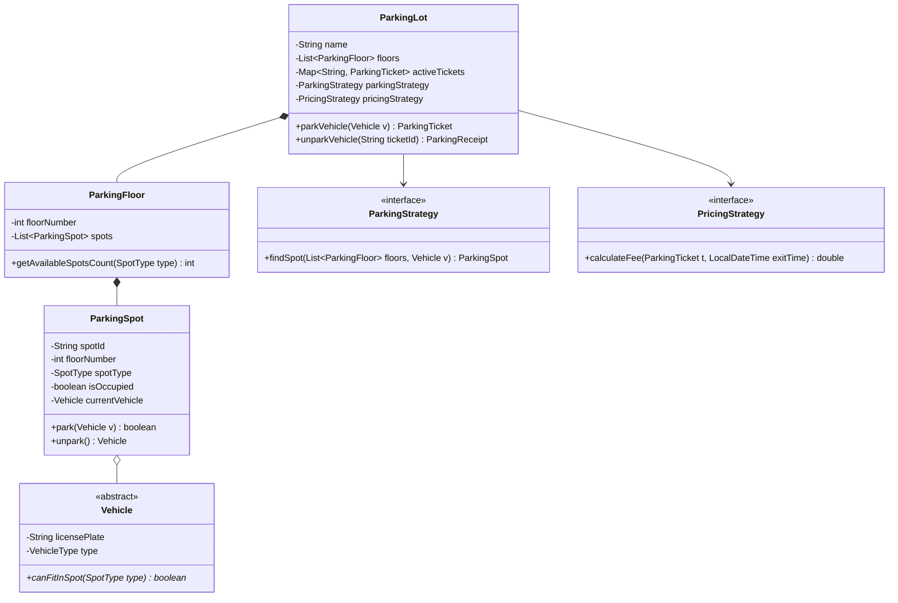

# 🚗 Solution & Architecture: Multi-Floor Parking Lot System

**Problem**: Design a multi-floor, multi-gate automated parking lot system.  
**Difficulty**: Medium | **Target Companies**: Amazon, Google, Uber, Microsoft, Walmart  
**Practice Template**: [`OOP/src/DesignParkingLot.java`](../src/DesignParkingLot.java)

---

## 1. Requirements & Clarifications

### Functional Requirements (In-Scope):
1. **Multi-Floor & Multi-Gate**: Support $N$ floors, with multiple entrance and exit gates.
2. **Vehicle Types**: `MOTORCYCLE`, `CAR`, `TRUCK`, `ELECTRIC`.
3. **Spot Compatibility Rules**:
   - `MOTORCYCLE`: Can fit in Motorcycle, Compact, or Large spots.
   - `CAR`: Can fit in Compact or Large spots.
   - `TRUCK`: Can only fit in Large spots.
   - `ELECTRIC`: Can fit in Electric (with charging point), Compact, or Large spots.
4. **Ticketing & Fees**:
   - Issue a unique `ParkingTicket` upon entry with timestamp and assigned spot.
   - Calculate fee on exit based on duration and vehicle hourly rate.
5. **Pluggable Allocation Strategy**: Lowest-floor-first, nearest-to-entrance, or best-fit.

### Non-Functional Requirements:
- **Thread Safety**: Concurrent arrivals at different gates must not double-book the same spot.
- **Extensibility**: Adding new vehicle types or surge pricing must not modify existing core classes (Open/Closed Principle).

---

## 2. Core Entities & Class Diagram



---

## 3. Key Design Patterns Used

1. **Strategy Pattern**:
   - `ParkingStrategy`: Allows switching between `LowestFloorFirstStrategy`, `NearestEntranceStrategy`, and `BestFitStrategy`.
   - `PricingStrategy`: Allows switching between `HourlyPricingStrategy`, `FlatFeeStrategy`, and `SurgePricingStrategy`.
2. **Factory Method**:
   - Encapsulates creation of different vehicles (`Car`, `Motorcycle`, `Truck`, `ElectricCar`).
3. **Singleton Pattern**:
   - The central `ParkingLot` orchestrator is typically managed as a thread-safe singleton in production.

---

## 4. Complete Reference Implementation

```java
// Spot allocation logic:
public class LowestFloorFirstStrategy implements ParkingStrategy {
    @Override
    public ParkingSpot findSpot(List<ParkingFloor> floors, Vehicle vehicle) {
        for (ParkingFloor floor : floors) {
            for (ParkingSpot spot : floor.getSpots()) {
                if (!spot.isOccupied() && vehicle.canFitInSpot(spot.getSpotType())) {
                    return spot;
                }
            }
        }
        return null; // Lot full for this vehicle type
    }
}

// Thread-safe Spot reservation:
public synchronized boolean park(Vehicle vehicle) {
    if (isOccupied || !vehicle.canFitInSpot(spotType)) {
        return false;
    }
    this.currentVehicle = vehicle;
    this.isOccupied = true;
    return true;
}

public synchronized Vehicle unpark() {
    if (!isOccupied) return null;
    Vehicle removed = this.currentVehicle;
    this.currentVehicle = null;
    this.isOccupied = false;
    return removed;
}

// Fee calculation:
public double calculateFee(ParkingTicket ticket, LocalDateTime exitTime) {
    Duration duration = Duration.between(ticket.getEntryTime(), exitTime);
    long hours = Math.max(1, (long) Math.ceil(duration.toMinutes() / 60.0));
    double rate = hourlyRates.getOrDefault(ticket.getVehicleType(), 20.0);
    return hours * rate;
}
```

---

## 5. Interview Traps & Concurrency Edge Cases

1. **Race Condition on Gates**: If two entry gates simultaneously find the same free spot, both might assign it. Guard `spot.park()` with `synchronized` and re-verify `!isOccupied`.
2. **Defensive Copies**: Never return `return this.spots;` directly. Always wrap in `Collections.unmodifiableList(spots)` so external callers cannot mutate internal state.
3. **Time Duration Rounding**: Always handle minimum billing (e.g. at least 1 hour) and ceil fractions of hours.
