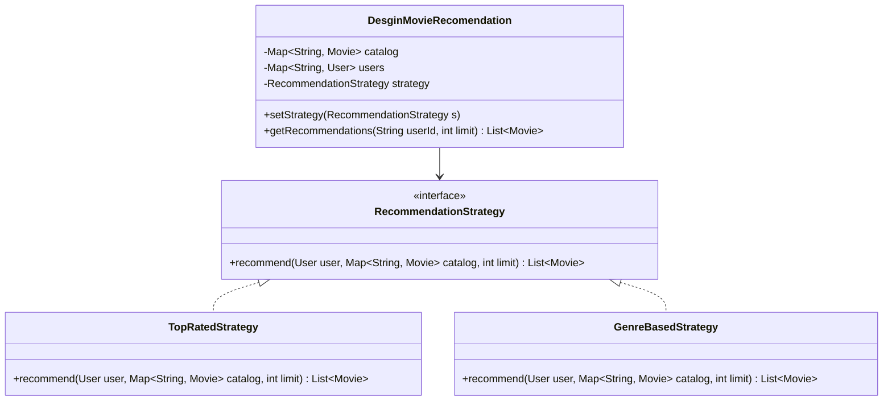

# 🎬 Solution & Architecture: Movie Recommendation System

**Problem**: Design a personalized movie recommendation engine with pluggable strategies.  
**Difficulty**: Medium | **Target Companies**: Netflix, Amazon Prime, Spotify, Hulu  
**Practice Template**: [`OOP/src/DesginMovieRecomendation.java`](../src/DesginMovieRecomendation.java)

---

## 1. Requirements & Clarifications

### Functional Requirements:
1. **Catalog & Users**:
   - `Movie`: ID, title, release year, genres, average rating, rating count.
   - `User`: ID, name, list of watched movies, map of ratings ($1.0$ to $5.0$).
2. **Pluggable Strategies (Strategy Pattern)**:
   - **`TopRatedStrategy`**: Recommends highest average-rated movies not yet watched by the user.
   - **`GenreBasedStrategy`**: Recommends unwatched movies sharing genres with movies the user rated highly ($\ge 4.0$).
3. **Runtime Strategy Swapping**: Change the active recommendation algorithm on the fly.

---

## 2. Strategy Pattern Architecture



---

## 3. Reference Implementation Snippets

### Top-Rated Filtering:
```java
public class TopRatedStrategy implements RecommendationStrategy {
    @Override
    public List<Movie> recommend(User user, Map<String, Movie> catalog, int limit) {
        return catalog.values().stream()
                .filter(m -> !user.hasWatched(m.getMovieId())) // Exclude watched
                .filter(m -> m.getRatingCount() > 0)
                .sorted(Comparator.comparingDouble(Movie::getAverageRating).reversed()
                        .thenComparingInt(Movie::getRatingCount).reversed())
                .limit(limit)
                .collect(Collectors.toList());
    }
}
```

### Genre-Based Filtering:
```java
public class GenreBasedStrategy implements RecommendationStrategy {
    @Override
    public List<Movie> recommend(User user, Map<String, Movie> catalog, int limit) {
        // Step 1: Find genres user liked (rated >= 4.0)
        Set<Genre> preferredGenres = new HashSet<>();
        for (Map.Entry<String, Double> entry : user.getRatedMovies().entrySet()) {
            if (entry.getValue() >= 4.0) {
                Movie movie = catalog.get(entry.getKey());
                if (movie != null) preferredGenres.addAll(movie.getGenres());
            }
        }

        // Step 2: Rank unwatched movies by genre overlap and rating
        return catalog.values().stream()
                .filter(m -> !user.hasWatched(m.getMovieId()))
                .filter(m -> m.getGenres().stream().anyMatch(preferredGenres::contains))
                .sorted((m1, m2) -> {
                    long overlap1 = m1.getGenres().stream().filter(preferredGenres::contains).count();
                    long overlap2 = m2.getGenres().stream().filter(preferredGenres::contains).count();
                    if (overlap1 != overlap2) return Long.compare(overlap2, overlap1);
                    return Double.compare(m2.getAverageRating(), m1.getAverageRating());
                })
                .limit(limit)
                .collect(Collectors.toList());
    }
}
```

---

## 4. Key Interview Traps

1. **Recommending Already Watched Movies**: A recommendation engine must never suggest movies the user has already viewed.
2. **Cold Start Problem**: Mention how to handle new users with no rating history (fallback to `TopRatedStrategy` or popular trending movies).
