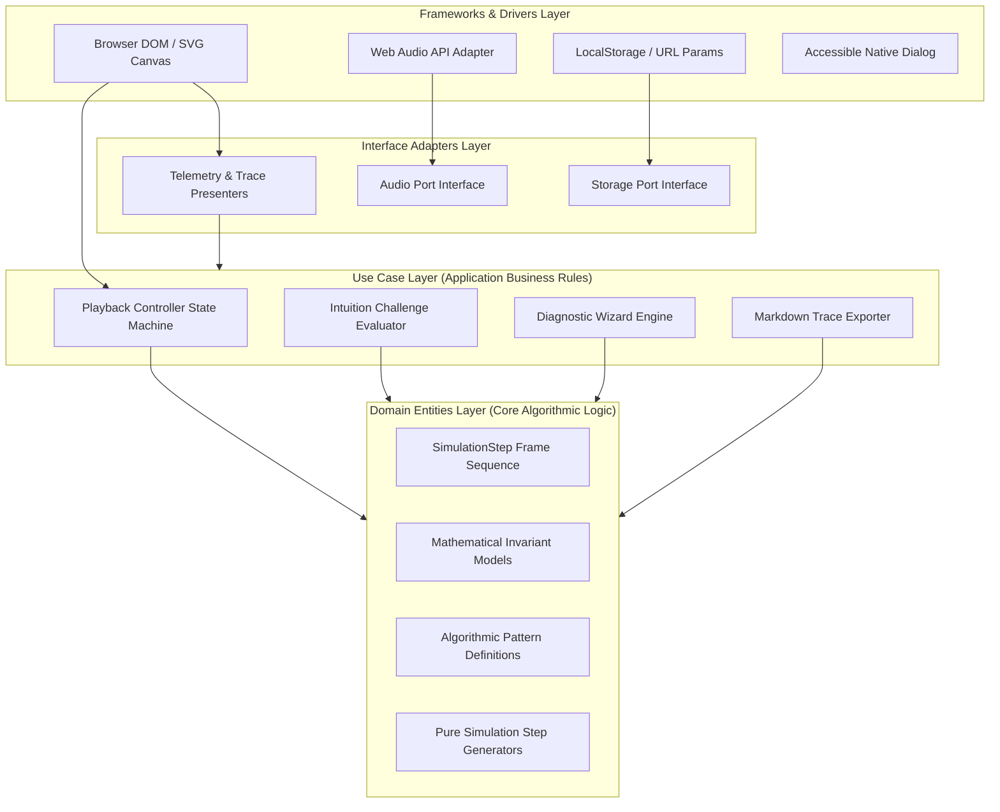

# SPEC-052: VisualizerStudio (Clean Architecture Invariant & State Workbench)

> **Status**: `VERIFIED`  
> **Difficulty**: `🔴 Hard`  
> **Category**: `Visualizer`  
> **Source**: `Interactive Algorithmic Workbench & Telemetry Engine`  
> **Video Explanation**: `[RisingBrain - Maximum Subarray with Sum K](https://youtu.be/dgjKO46bu3A)`  
> **Documentation / Read Link**: `[Clean Architecture: A Craftsman's Guide by Robert C. Martin](https://blog.cleancoder.com/uncle-bob/2012/08/13/the-clean-architecture.html)`  
> **Target Complexity**: Time `O(1)` per state transition | Space `O(F)` bounded frame tape ($F \le 500$)  

---

## 1. Problem Formulation & API Contract

### 1.1 Core Summary (Read Without Navigating)
An algorithmic visualizer studio engineered under **Clean Architecture** to eliminate tight coupling between rendering side-effects and simulation logic. Pure algorithmic generators produce immutable discrete execution frames (**Domain Layer**); playback controllers and challenge evaluators govern state transitions (**Use Case Layer**); telemetry formatters and audio/storage adapters bridge data (**Interface Adapter Layer**); and DOM/SVG engines handle UI painting (**Frameworks & Drivers Layer**). Guarantees reproducible bi-directional time-travel scrubbing ($O(1)$) and formal invariant verification without race conditions.

### 1.2 Full Description
Algorithmic visualization software frequently degrades into monolithic "spaghetti" code where DOM manipulation, Web Audio synthesis, interval timers, and algorithmic branching are entangled. This causes race conditions during rapid scrubbing, untestable decision logic, and audio distortion.

The **Visualizer Studio** system resolves these issues through strict **Clean Architecture (Inversion of Control & Dependency Rule)**:
1. **Domain Layer (Entities & Invariants)**: Encapsulates pure state snapshots (`SimulationStep`), algorithm pattern descriptors (`PatternEntity`), and mathematical invariants. Pure functions generate frames with zero browser dependencies.
2. **Use Case Layer (Application Business Rules)**: Implements `PlaybackController` (time-travel stepping, play/pause state machine, boundary enforcement), `ChallengeEvaluator` (interactive invariant prediction checks), `DiagnosticWizardService` (input-to-pattern inference), and `TraceExporter` (Markdown table synthesis).
3. **Interface Adapter Layer (Controllers & Presenters)**: Translates domain data into presentation formats (`TelemetryPresenter`, `TraceTablePresenter`) and exposes boundary ports (`AudioPort`, `StoragePort`).
4. **Frameworks & Drivers Layer (UI Details)**: Browser DOM view, SVG canvas renderers, Web Audio API synthesizers, and light-dismissable `<dialog>` modals.



### 1.3 Method Signature & Clean Architecture API Contract
```java
package Visualizer;

import java.util.List;
import java.util.Map;

public class VisualizerStudio {

    // 1. Domain Entities
    public record SimulationStep(
        int stepIndex,
        String type,
        String title,
        String explanation,
        int activeLine,
        Map<String, Object> telemetry,
        boolean isTerminal
    ) {}

    public record PatternEntity(
        String id,
        String name,
        String category,
        String complexity,
        String invariantProof,
        String videoUrl,
        String docsUrl,
        String quickSummary
    ) {}

    // 2. Ports (Boundary Interfaces)
    public interface AudioPort {
        void playStep();
        void playSuccess();
        void playError();
        boolean toggle();
        boolean isEnabled();
    }

    public interface StoragePort {
        String get(String key);
        void set(String key, String value);
        void remove(String key);
    }

    // 3. Use Cases
    public interface IPlaybackController {
        void loadSteps(List<SimulationStep> steps);
        SimulationStep getCurrentStep();
        int getCurrentIndex();
        int getTotalSteps();
        boolean isPlaying();
        void play();
        void pause();
        void stepForward();
        void stepBackward();
        void seek(int targetIndex);
        void reset();
        void setSpeed(double multiplier);
        double getSpeed();
    }

    public interface IChallengeEvaluator {
        boolean submitAnswer(int stepIndex, int optionIndex, int correctIndex);
        int getScore();
        int getTotalAnswered();
        double getAccuracy();
        void resetScore();
    }

    public interface IDiagnosticWizard {
        String diagnose(String dataStructure, String algorithmicGoal);
    }

    public interface ITraceExporter {
        String exportMarkdownTable(List<SimulationStep> steps);
    }
}
```

### 1.4 Pre-Conditions
- `steps` collection passed to `loadSteps()` is non-null and non-empty.
- Each `SimulationStep` contains deterministic invariant telemetry and valid 1-indexed code line highlights.
- Playback speed multiplier is strictly positive ($0.25 \le \text{multiplier} \le 5.0$).
- Target seek index is bounded within $[0, \text{totalSteps} - 1]$.

### 1.5 Post-Conditions
- Replay state transitions are strictly deterministic ($S_k$ is identical on forward advance, backward retreat, or direct seek).
- Domain and Use Case logic executes completely independent of browser/DOM environments (100% testable in JVM / headless node).
- When reaching the terminal step ($k = \text{totalSteps} - 1$), playback automatically pauses without interval overrun.
- Muted or failed audio adapter calls degrade gracefully via Null Object Pattern without crashing the engine.

---

## 2. Mathematical Invariants & Algorithmic Principles

### 2.1 Core Architectural Invariants
1. **Deterministic State Replay Invariant**:
   For any algorithmic pattern $P$ and valid input $I$, the simulation generator is a pure function:
   $$\mathcal{G}(P, I) \to \vec{S} = \langle S_0, S_1, \dots, S_{m-1} \rangle$$
   The state frame $S_k$ is strictly immutable once generated. Accessing $S_k$ via `seek(k)` is an idempotent operation with $O(1)$ time complexity and zero side-effects.

2. **Bidirectional Reversibility (Time Travel Invariant)**:
   For any arbitrary navigation sequence of operations $O_1, O_2, \dots, O_p \in \{\text{stepForward}, \text{stepBackward}, \text{seek}\}$ ending at step index $k$, the active telemetry and display snapshot satisfies:
   $$\text{CurrentState} \equiv S_k$$
   There is no internal state accumulated outside the tape frame $\vec{S}$.

3. **Clean Architecture Boundary Invariant (Dependency Rule)**:
   Source code dependencies point inward only:
   $$\text{UI Layer} \longrightarrow \text{Adapters} \longrightarrow \text{Use Cases} \longrightarrow \text{Entities}$$
   Neither `SimulationStep` nor `IPlaybackController` nor `IChallengeEvaluator` contains references to `document`, `window`, `HTMLElement`, `AudioContext`, or CSS.

4. **Bounded Playback Termination Invariant**:
   If `isPlaying == true` and current index $k = m - 1$, the playback controller executes `pause()` and stops scheduling future transitions:
   $$\forall t > t_{\text{terminal}}, \quad \text{isPlaying} = \text{false} \land k = m - 1$$

### 2.2 Proof of Correctness Sketch
- **Completeness**: Because algorithmic frames are generated ahead-of-time as an indexed sequence $\vec{S}$, seeking to any step $k \in [0, m-1]$ is a direct array index access $O(1)$.
- **Soundness**: Every step explicitly packages its limiting bottleneck (e.g. `min(height[L], height[R])`, current duplicate window index, or in-degree reduction count) into its immutable `telemetry` map, guaranteeing mathematical invariants can be inspected and verified without re-running the solver.

---

## 3. Constraints & Complexity Budget

### 3.1 Constraint Boundaries
| Parameter | Range | Architectural Budget |
| :--- | :--- | :--- |
| Tape Size ($F$) | $1 \le F \le 500$ frames | Fits fully in memory ($< 1$ MB heap); $O(1)$ random access |
| Frame Render Latency | $< 16.6$ ms | Sustains smooth 60 FPS animation updates during continuous playback |
| Seek / Step Latency | $O(1)$ time | Instant responsiveness on scrubber slider input |
| Speed Multipliers | $0.5\times$ to $2.5\times$ | Timer interval range between $360$ ms and $1800$ ms |
| Custom Input Size ($N$) | $1 \le N \le 100$ | Input validation and step generation in $< 5$ ms |

### 3.2 Complexity Budget
- **State Lookup**: $O(1)$ time, $O(1)$ auxiliary space.
- **Simulation Generation**: $O(N)$ to $O(N \log N)$ depending on algorithm; generated once per problem/preset.
- **Markdown Trace Generation**: $O(F \times C)$ where $C$ is column count; completes in $< 2$ ms.

---

## 4. Acceptance Criteria & Test Matrix

| ID | Test Scenario | Input / Action | Expected Output | Clean Architecture Invariant Verified |
| :--- | :--- | :--- | :--- | :--- |
| **TC-01** | Happy Path Step Traversal | Initialize with 5 steps, step forward 4 times | Index = 4, Title = Step 5 title, Terminal = true | Sequential state progression through tape |
| **TC-02** | Bidirectional Reversibility | Step forward to 3, step backward to 1, seek to 3 | State at 3 identically matches previous visit | Reversible time travel without state corruption |
| **TC-03** | Boundary Protection Underflow | Seek to -1 or step backward at index 0 | Index remains 0; no exception thrown | Out-of-bounds lower clamp ($k \ge 0$) |
| **TC-04** | Boundary Protection Overflow | Step forward past terminal frame ($k = 4$) | Index remains 4; `isPlaying` switches to `false` | Out-of-bounds upper clamp ($k \le m-1$) |
| **TC-05** | Intuition Challenge Evaluator | Submit correct answer for Step 2; incorrect for Step 3 | Score = 1/2 (50% accuracy), state unchanged | Evaluation without mutating simulation tape |
| **TC-06** | Diagnostic Wizard Logic | Query `("array", "contiguous-window")` | Returns `"sliding-window"` | Pure decision rule evaluation |
| **TC-07** | Markdown Trace Table Export | Export 3 steps with 4 telemetry columns | Valid Markdown table string containing `\|` dividers | Format conversion isolated in Use Case |
| **TC-08** | Null Audio Adapter Safety | Trigger audio cues with disabled/mock audio | Returns silently with zero exceptions | Null Object Pattern on Port boundary |
| **TC-09** | Playback Reset Contract | Run to step 4, call `reset()` | Index = 0, `isPlaying` = false | Invariant state restoration |
| **TC-10** | Headless Execution Soundness | Run complete test harness in pure Java JVM | All assertions pass without browser or DOM mocks | Clean Architecture layer decoupling |

---

## 5. Design & Algorithmic Strategy

### 5.1 Clean Architecture Layer Mapping
```text
src/Visualizer/VisualizerStudio.java
├── Layer 1: Domain Entities (Pure Records & Models)
│   ├── SimulationStep
│   ├── PatternEntity
│   └── DiagnosticRule
│
├── Layer 2: Use Cases & Interactors (Application Logic)
│   ├── PlaybackController (State Machine)
│   ├── ChallengeEvaluator (Intuition Engine)
│   ├── DiagnosticWizardEngine (Pattern Recommender)
│   └── MarkdownTraceExporter (Trace Synthesizer)
│
├── Layer 3: Interface Adapters & Ports
│   ├── AudioPort (Port)
│   ├── StoragePort (Port)
│   ├── TelemetryPresenter (Presenter)
│   └── ConsoleAudioAdapter / SilentAudioAdapter (Adapter)
│
└── Layer 4: Infrastructure & Driver (Execution Harness)
    └── VisualizerStudioDriver (Entry Point & Test Suite)
```

### 5.2 Failure Modes & Pitfalls
- **Pitfall 1: Interval Timer Leaks**: When switching patterns or resetting while auto-playing, old intervals must be cleared before instantiating new timers to prevent exponential speedup.
- **Pitfall 2: Mutable Telemetry Pollution**: If simulation steps reuse mutable object references (e.g. sharing a single array reference across steps), mutating the array retroactively corrupts previous steps. Every step must clone its array snapshot (`[...heights]` / `Arrays.copyOf`).
- **Pitfall 3: Browser API Leakage into Domain**: Importing DOM elements or calling Web Audio inside generator logic breaks headless automated testing and violates the Dependency Rule.

---

## 6. Verification Trace Table

*Dry-run trace of `PlaybackController` state transitions over a 4-step tape*:

| Cycle | Method Invoked | Target Step | Current Index | `isPlaying` | Output / Active Line | Invariant Status |
| :---: | :---: | :---: | :---: | :---: | :---: | :---: |
| 0 | `loadSteps(tape)` | $S_0$ | 0 | `false` | `Line 2: Init` | $S_0$ loaded; valid lower boundary |
| 1 | `play()` | $S_0 \to S_1$ | 1 | `true` | `Line 6: Evaluate` | Interval running; advance to 1 |
| 2 | `stepForward()` | $S_1 \to S_2$ | 2 | `true` | `Line 8: Advance L` | Monotonic forward step |
| 3 | `stepBackward()`| $S_2 \to S_1$ | 1 | `true` | `Line 6: Evaluate` | Reversible step restores $S_1$ exactly |
| 4 | `seek(3)` | $S_1 \to S_3$ | 3 | `true` | `Line 12: Terminate` | Instant $O(1)$ random seek |
| 5 | Timer Tick | $S_3 \to \text{End}$ | 3 | `false` | `Auto-paused` | Bounded termination invariant satisfied |
